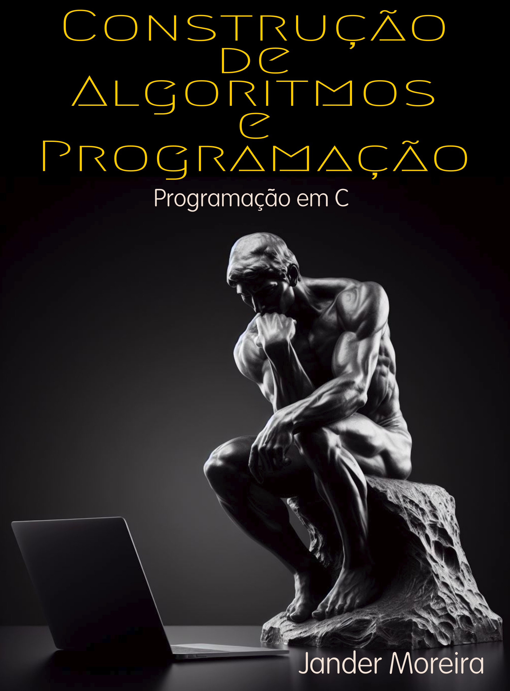

Livros (em produção):

|                                                                                    |                                                                                                                     |
| ---------------------------------------------------------------------------------- | ------------------------------------------------------------------------------------------------------------------- |
| {width="120px"}                           | [Construção de Algoritmos e Programação: Programação em C](./cap-linguagem-c){target="_blank"}                      |
| {width="120px"} | [Construção de Algoritmos e Programação: Algoritmos para quem já sabe programar](./cap-algoritmos){target="_blank"} |
| {width="120px"} | [Construção de Algoritmos e Programação: Prática com algoritmos](./cap-pratica-algoritmos){target="_blank"} |
